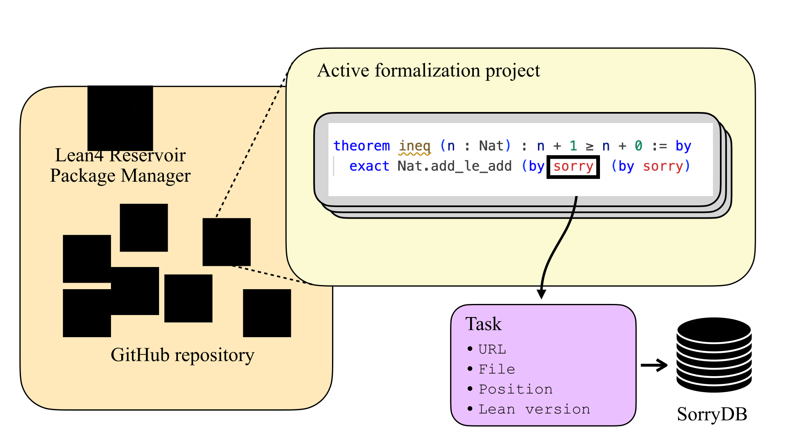

# Lean4 SorryDB

[](https://arxiv.org/abs/2603.02668)

The SorryDB project aims to help bridge the gap between automated (formal) theorem
proving "in the lab" and adoption by mathematicians. It provides tools and
infrastructure to facilitate developing, testing, and ultimately using AI proof agents
against "real world" mathematical propositions in Lean.

<p align="center">
  
</p>


At its core, it provides a continuously updating *dataset* of `sorry`
statements in public Lean 4 repositories. It also provides template *agents*
that attempt to prove such statements, and a *verifier* that checks the
correctness of proposed proofs.

Eventually, we hope to host a continuously running sorry-filling competition,
with a public *leaderboard*. For a detailed explanation of the project's
motivation, philosophy, and long-term goals, see the paper

- [SorryDB: Can AI Provers Complete Real-World Lean Theorems?](https://arxiv.org/abs/2603.02668)
*Austin Letson, Leopoldo Sarra, Auguste Poiroux, Oliver Dressler, Paul Lezeau, Dhyan Aranha, Frederick Pu, Aaron Hill, Miguel Corredera Hidalgo, Julian Berman, George Tsoukalas, Lenny Taelman*

and the [ABOUT.md](doc/ABOUT.md) in the doc section.


## The Dataset

### The nightly SorryDB dataset

The main instance of a SorryDB database is hosted at [sorrydb-data](https://github.com/austinletson/sorrydb-data). It is updated nightly, by crawling Lean 4 repositories listed on [Reservoir](https://reservoir.lean-lang.org/) for sorried (`Prop`-valued) statements.

For each such statement, it contains all information needed to locally reproduce
it. This includes repository information (remote url, branch, commit hash), the
Lean 4 version used, and coordinates of the sorry within the repository (path, line, column).

The nightly snapshot of the SorryDB dataset is available [here](https://github.com/SorryDB/sorrydb-data/blob/master/sorry_database.json).

See [DATABASE.md](doc/DATABASE.md) for more detailed information on the database
format. In short: the dataset is updated nightly using a crawler which uses `git` and `lake build` to
clone and build the repository locally, and then uses the [Lean
REPL](https://github.com/leanprover-community/repl/) to locate and analyze
sorries in the repository.


### Snapshot `SorryDB-2601`
This is the snapshot evaluated in the paper "SorryDB: Can AI Provers Complete Real-World Lean Theorems?"

The json file with the URLs of the sorries is available in [data/SorryDB_2601.json](data/SorryDB_2601.json).


## The sorry-proving strategies

We treat each entry of the database as a theorem-proving challenge, where the
precise task is to replace the `"sorry"` string with a string of tactics that
fills the proof. The input to a strategy is an item of the dataset, and each strategy
is asked to clone and build the repository, and attempt to find a proof of the
given sorry.

We provide several example strategies:

1. `rfl_strategy` which checks if the tactic `rfl` (or `simp`) completes the sorried proof.
2. `llm_strategy` which polls an LLM to make a one-shot attempt at filling the proof.
3. `tactic_strategy` which queries an LLM to fill the proof tactic by tactic.
4. `agentic_strategy` which uses a LangGraph agent with tool use to iteratively search for and construct a proof.

These are deliberately primitive (and hence weak), and *not* meant to provide a baseline evaluation. We hope they are helpful as templates on which one can base
stronger sorry-proving strategies.

See [STRATEGIES.md](doc/STRATEGIES.md) for the specification of input and output of a
strategy, and more information on the sample strategies.

### Add your own strategy

Implement the `SorryStrategy` interface by defining a `prove_sorry` method:

```python
from pathlib import Path
from sorrydb.runners.json_runner import SorryStrategy
from sorrydb.database.sorry import Sorry

class MyStrategy(SorryStrategy):
    def prove_sorry(self, repo_path: Path, sorry: Sorry) -> str | None:
        # repo_path: local checkout of the repository
        # sorry.location: file path, line/column of the sorry
        # sorry.debug_info.goal: the proof goal at the sorry
        # Return a string to replace "sorry", or None if no proof found
        return None
```

Then register it in [run_morphcloud_local.py](sorrydb/cli/run_morphcloud_local.py) to use it with the evaluation runners.

To evaluate a new LLM provider, you can extend `LLMStrategy` in [llm_strategy.py](sorrydb/strategies/llm_strategy.py) by adding a new provider case to its `__init__` method. The strategy uses [LangChain](https://www.langchain.com/langchain) chat models, so any LangChain-compatible chat model can be plugged in.

Experiments were run on a 1000-sorry slice of `SorryDB_2601`, available at [data/2025_12_experiment_all_reservoir_3_months/1000_3_months_reservoir.json](data/2025_12_experiment_all_reservoir_3_months/1000_3_months_reservoir.json). Below is the performance of the considered strategies:


| Approach | Pass@1 | Pass@32 |
|:---|:---:|:---:|
| *Deterministic* |||
| &nbsp;&nbsp;Trivial | 2.1% | — |
| &nbsp;&nbsp;Tactics | 8.4% | — |
| *General-purpose LLM* |||
| &nbsp;&nbsp;GPT 5.2 | 6.2% | 13.2% |
| &nbsp;&nbsp;Claude Opus 4.5 | 7.8% | 15.4% |
| &nbsp;&nbsp;Gemini Flash 3 | 10.8% | 20.5% |
| &nbsp;&nbsp;Gemini Pro 3 | 11.0% | 20.5% |
| &nbsp;&nbsp;Qwen 3 | 5.0% | 8.1% |
| *Specialized LLM* |||
| &nbsp;&nbsp;Kimina Prover 8B | 1.0% | 6.6% |
| &nbsp;&nbsp;Goedel Prover v2 32B | 2.7% | 11.3% |
| *Iterative* |||
| &nbsp;&nbsp;Claude Opus 4.5 (SC) | 27.1% | — |
| &nbsp;&nbsp;Gemini Flash 3 (SC) | 27.9% | — |
| &nbsp;&nbsp;Gemini Flash 3 (Agentic) | 30.3% | — |
| **Combined** | **35.7%** ||


## Getting started

The easiest way to learn more about the SorryDB project is to have a look at our introductory notebook on Google Colab:

[](https://colab.research.google.com/github/SorryDB/SorryDB/blob/master/doc/Introduction_to_the_SorryDB_Project.ipynb)

### Setup

SorryDB uses [Poetry](https://python-poetry.org/) for dependency management and
packaging. To get started

1. [Install Poetry if you haven't already](https://python-poetry.org/docs/#installation)

2. Clone the repository and install dependencies:

   ```sh
   git clone https://github.com/SorryDB/SorryDB.git
   cd SorryDB
   poetry install
   ```

3. Activate the virtual environment:

   ```sh
   eval $(poetry env activate)
   ```

The command line scripts in [sorrydb/cli](sorrydb/cli) can now be run
from poetry's virtual environment by running:

`poetry run <script name> <options>`.

See the documents in [doc/](doc/) for more information on the various scripts
provided.

### Slicing your own dataset snapshot

We provide various tools to create and manage your own database. See
[DATABASE-SCRIPTS.md](doc/DATABASE-SCRIPTS.md) for instructions in setting up
your own database (e.g. to scrape your own repository).


### Running strategies

Strategies can be run locally or at scale via the MorphCloud runner. The two main scripts are:

- [run_morphcloud_agent](sorrydb/cli/run_morphcloud_agent.py): runs strategies at scale on MorphCloud, parallelizing across sorries.
- [run_morphcloud_local](sorrydb/cli/run_morphcloud_local.py): runs a strategy locally on a single sorry, useful for development and debugging.

The other scripts in [sorrydb/cli](sorrydb/cli) are for local testing purposes.

Below are a few examples.

**Local evaluation** (on a single sorry, with a local repo checkout):

RFL strategy:
```sh
poetry run python -m sorrydb.cli.run_morphcloud_local \
  --repo-path tests/mock_lean_repository \
  --sorry-path tests/mock_sorries/single_sorry.json \
  --agent-strategy '{"name": "rfl"}' \
  --output-path outputs/local
```

LLM strategy (e.g. Claude):
```sh
poetry run python -m sorrydb.cli.run_morphcloud_local \
  --repo-path tests/mock_lean_repository \
  --sorry-path tests/mock_sorries/single_sorry.json \
  --agent-strategy '{"name": "llm", "args": {"model_config": {"provider": "anthropic", "params": {"model": "claude-sonnet-4-5"}}}}' \
  --output-path outputs/local
```

Agentic strategy (iterative with thinking):
```sh
poetry run python -m sorrydb.cli.run_morphcloud_local \
  --repo-path tests/mock_lean_repository \
  --sorry-path tests/mock_sorries/single_sorry.json \
  --agent-strategy '{"name": "agentic", "args": {"model": "claude-sonnet-4-5", "max_iterations": 16, "enable_tools": true}}' \
  --output-path outputs/local
```

**Cloud evaluation** (on a list of sorries, parallelized via MorphCloud):

```sh
poetry run python -m sorrydb.cli.run_morphcloud_agent \
  --sorry-file data/2025_12_experiment_all_reservoir_3_months/1000_3_months_reservoir.json \
  --max-workers 25 \
  --output-dir outputs/gemini-flash \
  --agent-strategy '{"name": "llm", "args": {"k": 32, "model_config": {"provider": "google", "params": {"model": "gemini-3-flash-preview"}}}}'
```

See [eval_commands.md](doc/eval_commands.md) for the full list of evaluation commands and provider configurations.

## Testing

```sh
poetry run pytest                        # Run CI tests
poetry run pytest -m local_only          # Run local-only strategy tests
```

Local-only tests validate all agent strategies (rfl, simp, supersimple, tactic, agentic, llm with Anthropic/Google/DeepSeek/Kimina, cloud_llm) against a mock sorry. These require API keys and are excluded from CI.

## Contributing

See `CONTRIBUTING.md` for contribution guidelines.
