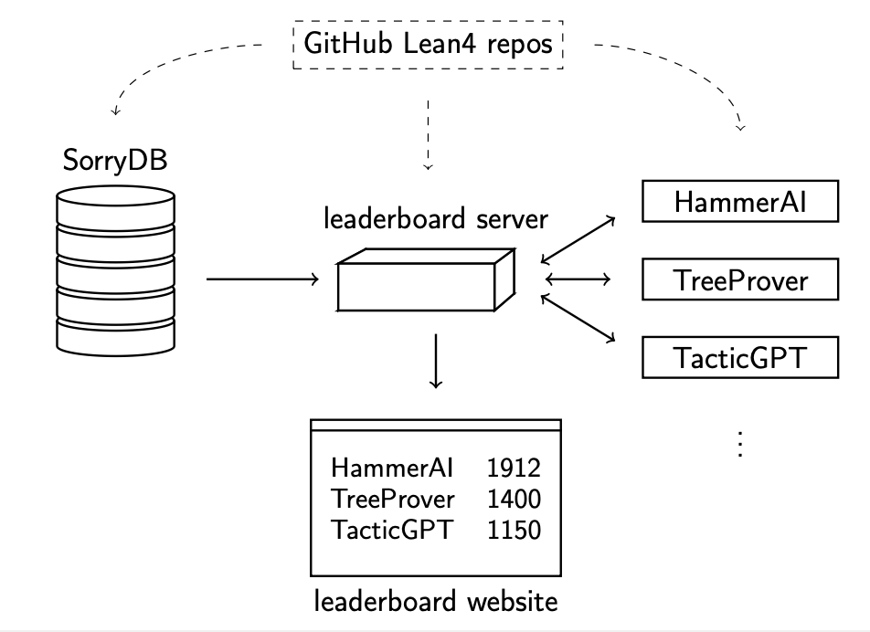

# SorryDB and Leaderboard

## Introduction

Automated (formal) theorem proving has the potential to make proof assistants such as Lean easier to use, and ultimately to become a useful tool in mathematical research. However, at the moment there is a significant gap between automated theorem proving "in the lab" and adoption by mathematicians in "real world" conditions. This project aims to help bridge this gap by setting up a continuously running competition that evaluates the performance of AI theorem provers on "sorry" statements in public repositories of ongoing Lean formalization projects.

The key features of this system are

1. A focus on *research mathematics* (as opposed to competition mathematics), in all its diversity.
2. The use of new, not-yet-proven statements to minimize the impact of data contamination on evaluation.
3. A minimal barrier between competition performance and real-world adoption.
4. An open design which allows users to add new or existing AI theorem provers to the competition with minimal engineering effort.

This project was motivated by Jason Rute's talk [*The Last Mile*](https://www.youtube.com/watch?v=Yr8dzfVkeHg). It is much inspired by the [*miniCTX*](https://cmu-l3.github.io/minictx/) benchmark, the [*LeanAgent*](https://arxiv.org/abs/2410.06209) system, and the somewhat analogous [*SWE-bench*](https://www.swebench.com/) for software engineering.

## Using sorry statements from public repositories

Mathematicians often collaborate on formal mathematics projects in Lean, hosting their work on GitHub. These works-in-progress frequently contain formally stated theorems with proofs deferred to later stages, marked by the `sorry` placeholder.

Each day dozens of sorry statements are added to public repositories. They vary wildly in subject area and difficulty. Some are major theorems (perhaps the statement of the final target of the formalization project), others are routine lemmas (such as easy consequences of results already somewhere in [mathlib](https://leanprover-community.github.io/mathlib-overview.html)), which the author has postponed filling in.

We propose to compare automated (formal) proof systems by continuously testing their performance in proving such sorry statements. Below is a description of the intended final product.

## Future system description

We envision a setup consisting of a *database* of sorries, a *leaderboard*
server serving sorries from the database, and competing *clients* implementing
different theorem proving systems. Below we describe this in more detail.

### The database

*SorryDB* is a continuously updating database of sorry statements from public
Lean repositories. It locally reproduces and verifies these statements, ensuring
they compile correctly and represent mathematical propositions (with type
`Prop`), not definitions to be filled. The database stores all information
necessary to locally reproduce the sorry statements.

This provides a source of real-world problems for training and evaluating AI
theorem provers. The continuous influx of new problems helps mitigate training
data contamination.

### The leaderboard server

The *leaderboard server* manages the live competition by selecting recent open sorry statements from the database, serving them to competitors, and verifying their solutions. It maintains a live ranking of all participating clients.

Eventually, the server could also generate automated pull requests (with the permission of repository owners) to incorporate the generated proofs.

### Agents

Agents poll the server for sorry statements, reproduce them locally, and attempt
to prove them within the given time limit. Successful solutions are uploaded
back to the server. We plan to provide sample agent implementations using various Lean
interaction tools to facilitate participation.

### Scoring

Traditional benchmark percentages do not adequately capture performance in this
context due to widely varying problem difficulty, inclusion of potentially unsolvable
statements, and asynchronous participation of competitors (which may join later, leave early, or experience downtime).

Instead, we propose an ELO-like rating system that measures relative performance. Once a client polls the server they are committed to the sorry they get served. In particular, for every (sorry, client) pair there are three potential outcomes: succeed, fail, did-not-compete. Whenever one competitor succeeds, and another fails at the same problem, the rating of those competitors gets updated.
