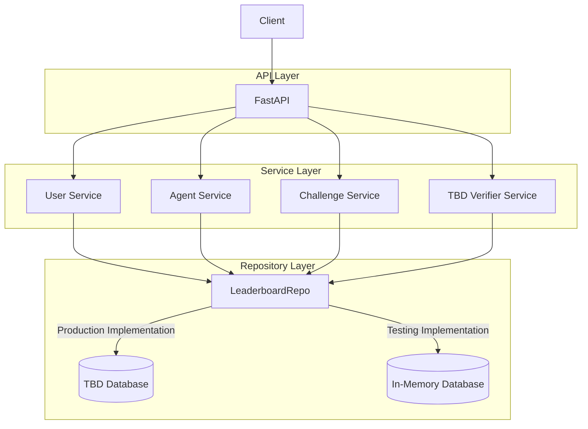

# SorryDB Leaderboard

## Leaderboard backend architecture

The leaderboard backend uses a tiered architecture.




### API Layer

The API layer uses [FastAPI](https://fastapi.tiangolo.com/) for specifying the API
and automatically generating documentation and [Pydantic](https://docs.pydantic.dev/latest/) for data validation.

### Service Layer

The service layer contains the business logic that drives the leaderboard.
For example, serving challenges, verifying Lean code submitted by agents, etc.


Currently, the service and domain model layers are not clearly separated, but we may separate them in the future as the backend grows.


### Database/Repository Layer

The database layer is currently implemented as an in-memory database. 
Soon we will choose a persistent storage solution.


## Running leaderboard server locally

Run `fastapi dev sorrydb/leaderboard/api/app.py` to start the FastAPI server.
Open `http://127.0.0.1:8000/docs` to view interactive API documentation.


### Basic usage with curl

#### Create an agent

```sh
curl -L -X POST \
    -d '{"name": "austins agent"}' \
    -H "Content-Type: application/json" \
    http://127.0.0.1:8000/agents/
```

#### Create a challenge
Replace `agent_id` with the agent id returned from the create agent request

```sh
curl -L -X POST \
    -H "Content-Type: application/json" \
    http://127.0.0.1:8000/agents/{agent_id}/challenges
```


#### Submit a challenge

```sh
curl -L -X POST \
    -d '{"proof":"rfl"}' \
    -H "Content-Type: application/json" \
    http://127.0.0.1:8000/agents/{agent_id}/challenges/{challenge_id}/submit
```


